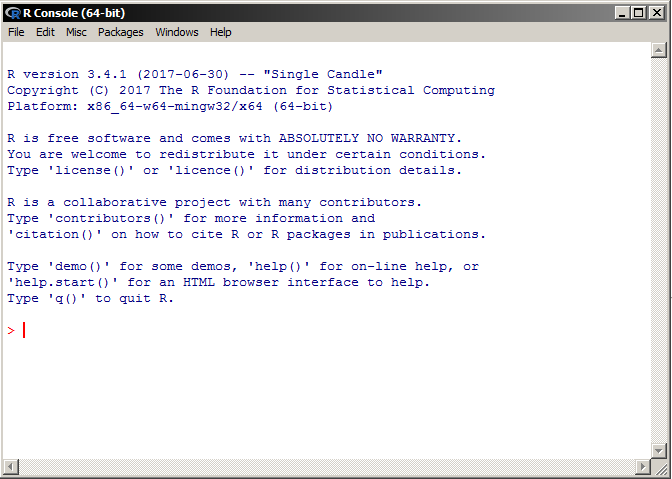
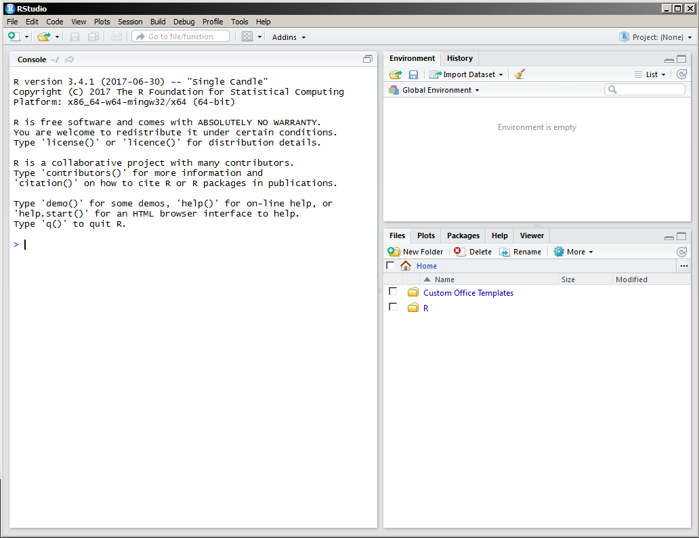
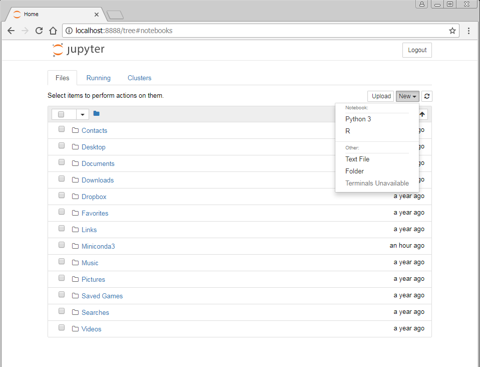
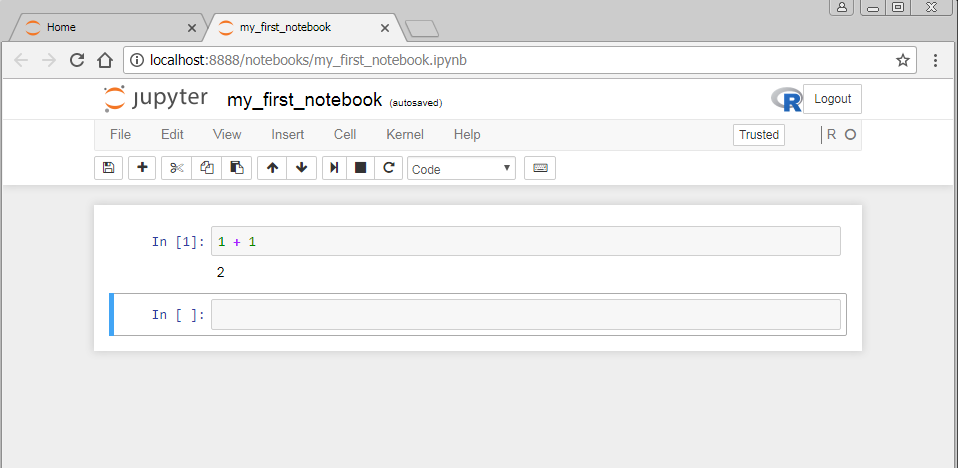

# Instalace a první spuštění R

V tomto tutoriálu si ukážeme, jak získat distribuci jazyka R a jaké máme možnosti co se týče software pro jeho snadné používání. Kupodivu je jich docela dost a všechny jsou v podstatě zdarma, tak se do toho pusťme.

## R jako takové

R je distribuováno jako open source software pod licencí [GPL](https://github.com/wch/r-source/blob/trunk/COPYING). Čili si ho může kdokoliv stáhnout a zdarma používat, jak se mu zachce. Stačí si pouze na [stránkách projektu](https://cloud.r-project.org/) stáhnout verzi pro váš systém.

Nejčastěji asi budeme chtít používat R pod systémem Windows, takže se v tomto tutoriálu omezíme pouze na tuto variantu, ale pro ostatní operační systémy je postup velice podobný.

 1. Ze [stránek](https://cloud.r-project.org/) stáhneme instalační soubor. Z nabídky různých binárek vybereme možnost 'base', což je holá instalace, která v sobě obsahuje ty nejzákladnější funkce.
 2. Soubor spustíme a zobrazí se instalační dialog. Podle potřeby si upravíme nastavení a klikáme na tlačítka dokud se R nenainstaluje.
 3. Po spuštění přes zástupce v nabídce start by se nám mělo zobrazit okno s příkazovou řádkou:
    


## Vývojová prostředí

### RStudio

Jak jste už asi zjistili při instalaci a prvním spuštění, tak základní verze R vám opravdu nenabízí velké pohodlí při psaní příkazů a zobrazování výsledků vašich výpočtů. Nejste jediní, a proto vzniklo [RStudio](https://www.rstudio.com). Jeho open source verzi lze opět stáhnout pro celou řadu platforem [zde](https://www.rstudio.com/products/rstudio/download/#download). Pro použití RStudia je třeba již mít nainstalovanou distribuci R, jak jsme si ukázali výše. 

Instalace je obdobná a pokud vše proběhlo, jak mělo, tak se vám po nastartování RStudia otevře mnohem bohatší uživatelské rozhranní:



Co všechno RStudio umí a jak v něm pracovat je nad rámec tohoto krátkého tutoriálu, ale jedná se o velice intuitivní nástroj, jehož základní funkce lze pochopit během několika minut.

### Anaconda a Jupyter Notebook

Dalším velice populárním způsobem práce s R je pomocí tzv. Jupyter notebooků. Tento software se v podstatě snaží imitovat prostředí nástrojů jako je Matlab, Maple nebo Wolfram Mathematica. Asi nejblíže je však programu Mathematica. [Jupyter](http://jupyter.org/) byl původně vytvořen jako prostředí pro jazyk Python, který je ve vědecké sféře též velice populárním nástrojem, ale postupně byl rozšířen i o další jazyky jako je třeba R. Instalace tohoto software již vyžaduje větší snahu, neboť je třeba zkloubit dohromady více nástrojů. Mimo jiné i instalaci interpreteru pro jazyk [Python](https://www.python.org/). My si v tomto tutoriálu ukážeme, jak si toto vývojové prostředí rozhýbat na systému Windows, ale i na jiných platformách je postup téměř identický.

K Jupteru se ještě vrátíme, ale začneme teď představením jiného nástroje, [Anaconda](www.continuum.io/anaconda), který nemá s R nebo statistickou analýzou dat na první pohled nic společného, ale je velice užitečný. Zvláště pokud preferujete mít všechno na jednom místě a mít ve věcech pořádek, tak byste jeho použití určitě měli zvážit. Anaconda je totiž nástroj, který v sobě obsahuje výběr toho nejpoužívanějšího vědeckého software a pomocí integrovaného balíčkovacího systému nabízí uživateli vytvořit si vývojové prostředí na míru a bez zbytečného 'zaplevelení' vašeho operačního systému. Do tohoto prostředí lze nainstalovat téměř cokoliv, co se nachází v [repozitáři balíčků](https://anaconda.org/) (včetně samotného [R a RStudia](https://anaconda.org/r)).

My v našem tutoriálu budeme používat zmenšenou verzi Anacondy, Minicondu, která je k dispozici pro Windows hned v několika verzích. Jak si můžete všimnout při otevření [stránky pro download](https://conda.io/miniconda.html), Miniconda již má v sobě integrovaný jazyk Python a to jak verzi 3, tak starší verzi 2. V dnešní době již v podstatě až na vyjímečné případy není důvod používat verzi 2, takže my sáhneme po verzi 3.

Při instalaci Minicondy budeme dotázáni, zda chceme přidat naší distribuci do systémové proměnné PATH. Tahle proměnnná rozhoduje o tom, kde hledat spouštěcí soubory různých nástrojů v našem systému. My ji při instalaci modifikovat nechceme, a proto necháme zaškrtávací tlačítko tak, jak je (nezaškrtnuté), aby nedošlo ke konfliktům se softwarem, který je již na systému nainstalován. Ke spuštění nástroje použijeme tzv. Anaconda Prompt, který by měl být po instalaci dostupný z nabídky Start. Tento krok je specifický pouze pro systém Windows. Na ostatních platformách je možné používat rozhranní Minicondy přímo z vaší příkazové řádky.

Anaconda prompt je obyčejná příkazová řádka, která je ovšem obohacená o všechen software, který nám prostředí Miniconda nabízí. Vzhledem k tomu, že Miniconda je redukovaná v počtu balíčků, který si s sebou nese, tak ho zatím není mnoho. Aktuálně nainstalované balíčky si lze zobrazit příkazem `conda list`:

```no-highlight
(C:\Users\sichom\Miniconda3) C:\Users\sichom>conda list
# packages in environment at C:\Users\sichom\Miniconda3:
#
asn1crypto                0.22.0                   py36_0
cffi                      1.10.0                   py36_0
conda                     4.3.21                   py36_0
conda-env                 2.6.0                         0
console_shortcut          0.1.1                    py36_1
cryptography              1.8.1                    py36_0
idna                      2.5                      py36_0
menuinst                  1.4.7                    py36_0
openssl                   1.0.2l                   vc14_0  [vc14]
packaging                 16.8                     py36_0
pip                       9.0.1                    py36_1
pycosat                   0.6.2                    py36_0
pycparser                 2.17                     py36_0
pyopenssl                 17.0.0                   py36_0
pyparsing                 2.1.4                    py36_0
python                    3.6.1                         2
pywin32                   220                      py36_2
requests                  2.14.2                   py36_0
ruamel_yaml               0.11.14                  py36_1
setuptools                27.2.0                   py36_1
six                       1.10.0                   py36_0
vs2015_runtime            14.0.25123                    0
wheel                     0.29.0                   py36_0
```

Toto v podstatě znamená výběr toho nejnutnějšího a představuje balíčky nainstalované v aktuálním prostředí (tzv. rootu). Seznam prostředí, která se na systému momentálně nachází, lze získtat příkazem `conda env list`:

```no-highlight
(C:\Users\sichom\Miniconda3) C:\Users\sichom>conda env list
# conda environments:
#
root                  *  C:\Users\sichom\Miniconda3
```

Jak vidíme, zatím máme jen defaultní prostředí *root*, které je pro nás momentálně celkem nezajímavé. Čili si vytvoříme nové prostředí, které bude mít nainstalovaný všechen náš software. Stačí nám na to pouze jeden příkaz: `conda create -n statistika r rstudio`. Vypíše se nám dlouhý seznam balíčků, které budou do daného prostředí nainstalovány. Po odsouhlasení se balíčky stáhnou a nainstalují. Po úspěšné instalaci nám nástroj navrhne příkaz pro přístup do nového prostředí:

```no-highlight
#
# To activate this environment, use:
# > activate statistika
#
# To deactivate this environment, use:
# > deactivate statistika
#
# * for power-users using bash, you must source
#
```

Když tak učiníme, přenese nás nástroj do nově vytvořeného prostředí:

```no-highlight
(C:\Users\sichom\Miniconda3) C:\Users\sichom>activate statistika

(statistika) C:\Users\sichom>
```

Všimněte si změny tvaru příkazové řádky, která teď obsahuje jméno našeho prostředí, které jsme výše specifikovali pomocí parametru `-n statistika`. Po zadání příkazu `conda env list` již také vidíme naše prostředí v seznamu:

```no-highlight
(statistika) C:\Users\sichom>conda env list
# conda environments:
#
statistika            *  C:\Users\sichom\Miniconda3\envs\statistika
root                     C:\Users\sichom\Miniconda3
```

Jelikož se jedná o aktivní prostředí, je v seznamu označeno hvězdičkou společně z cestou, kde jsou uloženy všechny soubory a software. Toto je právě hlavní důvod pro použití Minicondy, neboť nám umožňuje snadné spravování programů v našich projektech bez rizika konfliktů mezi různými verzemi a podobných neduhů, kterých bychom se mohli dočkat při instalaci přímo do operačního systému. Jednotlivá prostředí jsou plně nezávislá a lze se jich kdykoliv zbavit, což je neocenitelné pokud máte rádi ve věcech pořádek.

V příkazové řádce lze teď R jednoduše spustit pomocí příkazu `R`. Stejně tak lze spustit i RStudio (pomocí `rstudio`)  a potažmo další software, který byste mohli potřebovat. Celého prostředí se všemi balíčky se pak snadno můžete zbavit pomocí příkazu `conda env remove -n statistika` (nezapomeňte se z něj nejprve odhlásit pomocí `deactivate statistika`). Pokud se chcete zbavit i stažených balíčků a cache, můžete tak potom učinit příkazem `conda clean --all`. Zatím si však prostředí nechte. V tutoriálu jej budeme ještě potřebovat.

Vraťme se teď však k Jupyteru. V našem prostředí teď totiž máme k dispozici příkaz `jupyter-notebook`, který nám přímo v okně prohlížeče otevře aktuální adresář, což může vypadat nějak takto:



Rozhraní lze používat v podstatě stejně jako kterýkoliv jiný správce souborů. Po kliknutí na tlačítko *New* vpravo nahoře můžeme vytvářet adresáře a textové soubory, ale nejen to. Lze též vytvořit již zmiňované notebooky (jak v jazyce R, tak i Python). Po kliknutí na R by se nám pak měl otevřít nově vytvořený notebook:



Sem již můžeme psát jednotlivé příklady a přímo sledovat výstup z programu. Pro vykonání příkazů v buňce slouží kombinace kláves <kbd>shift</kbd> + <kbd>Enter</kbd>.  Jak s notebookem pracovat a jeho rozšířené funkce si však detailněji představíme až v [dalším tutoriálu](../02/).