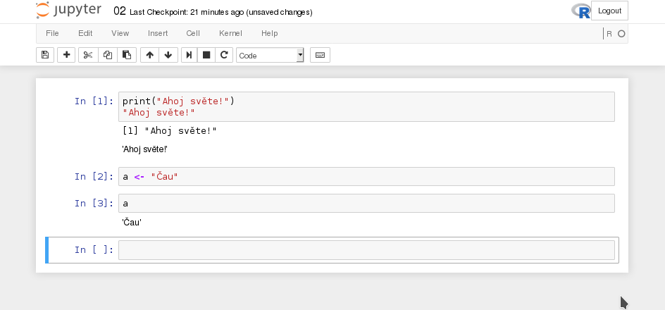
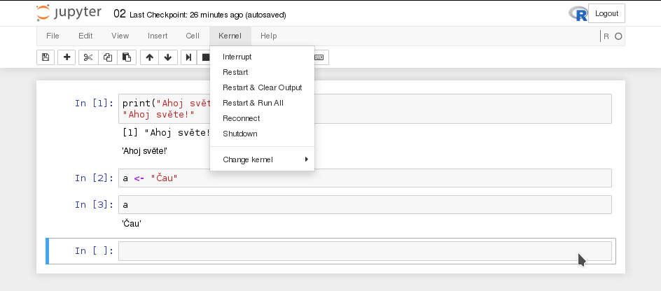
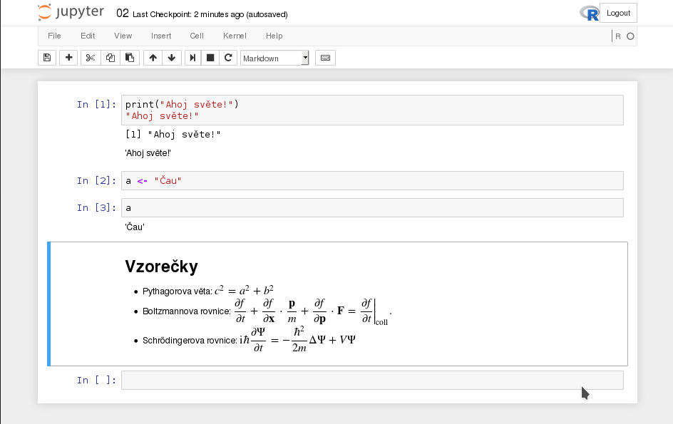

# Jupyter Notebook &ndash; letem světem

V tomto krátkém tutoriálu si ukážeme ty nejdůležitější praktické aspekty používaní Jupyter notebooků a zároveň si vyzkoušíme některé základní funkce jazyka R. V tomto tutoriálu se předpokládá, že již máme nainstalované vývojové prostředí a spuštěný notebook (popsáno v [předchozím tutoriálu](../01/)). Čili před sebou vidíme něco jako toto:


Jupyter notebooky fungují na systému buňek (*cells*), do kterých uživatel píše kód, který chce po programu vykonat. Výstup z buňky je potom po vykonání příkazu zobrazen pod ní. Ukažme si tedy jak vykonat jeden z nejjednodušších příkazů historie programovacích jazyků a totiž vypsání libovolného textu do výstupu programu. V R toho docílíme následovně:

```R
print("Ahoj světe!")
```

Když tento příkaz napíšete do buňky a vykonáte její obsah pomocí kláves <kbd>Shift</kbd> + <kbd>Enter</kbd>, dostane se vám následující odezvy:

```
[1] "Ahoj světe!"
```

V notebooku pak vše vypadá takto:


Číslo 1 v hranatých závorkách je speciální vlastností funkce `print` a slouží ke snadnější navigaci při čtení větších výstupů. Označuje aktuální pořadí prvku vypisovaného vektoru nebo číselné řady na začátku řádku. Tuto funkcionalitu však ještě mnohokrát uvidíme, takže jí tu nebudeme dále rozebírat.

K vypisování výstupu nemusíme vždy nutně využívat funkce `print`, ale lze též použít řetězec přímo:


Toto funguje díky tomu, že každý objekt v R má většinou danou nějakou textovou reprezentaci. Jupyter se pak vždy po vyhodnocení buňky pokusí nějakým způsobem zobrazit výsledek každého příkazu, jehož výstupem je nějaká textově reprezentovatelná hodnota. Všimněte si též, že bez použití funkce `print` již není součástí výstupu čislo 1 v hranatých závorkách a i formátování je taky trochu jiné.

Vytvořme si nyní novou buňku (většinou je však již vytvořena automaticky po vykonání buňky aktuální) a zkusme si několik dalších věcí. Nejjednodušším způsobem, jak vytvořit novou buňku je pomocí kombinace kláves <kbd>Esc</kbd> + <kbd>b</kbd>, která požádá program o vytvoření nové buňky pod tou aktuální (vždy označena rámečkem). Podobně funguje i zkratka <kbd>Esc</kbd> + <kbd>a</kbd>, která vytvoří novou buňku nad tou aktuální. Užitečná je i zkratka <kbd>Esc</kbd> + <kbd>d</kbd> + <kbd>d</kbd>, která smaže aktuální buňku. Mnohem více zkratek lze potom nalézt [zde](https://www.cheatography.com/weidadeyue/cheat-sheets/jupyter-notebook/).

Dalším nejčastějším úkonem je přiřazování do proměnných, což se [doporučuje](http://blog.revolutionanalytics.com/2008/12/use-equals-or-arrow-for-assignment.html) dělat operátorem `<-`:

```R
a <- "Čau."
```

Všechny proměnné, které v notebooku vytvoříte, žijí v kontextu tzv. *kernelu*. Kernel je vlastně interaktivní interpreter porgramovacího jazyka R a pamatuje si všechny vaše proměnné nebo funkce, které jste si nadefinovali. Čili proměnné a příkazy v buňkých se vykonávají v tomto globálním kontextu celého notebooku, který spravuje jeden konkrétní kernel. Jakmile si tedy někde nadefinujete proměnnou, máte k ní přístup z kterékoliv buňky v notebooku (až na vyjímky, ale o tom si řekneme později). Toto chování ilustruje použití nadefinované proměnné v další buňce našeho příkladu:



Toto chování pro nás občas může představovat problém. Obzvlášť pokud uděláme chybu a omylem si do prostředí zapíšeme něco, co tam nechceme. Než chybu manuálně opravovat, je často lepší prostě jenom restartovat aktuální kernel a všechny buňky znovu vyhodnotit. Toho lze docílit pomocí položky *Kernel* na ovládacím panelu:



Můžeme si vybrat hned z několika možností, ale tou nejčastější je pravděpodobně *Restart & Run All*, kterou se zresetuje aktuálně běžící kernel a všechny buňky se vyhodnotí znovu. Pouhý *Restart* jen zresetuje kernel, ale vaše výstupy zůstanou beze změny. Všechny vaše proměnné však zmizí.

Toto tedy byly ty nejnutnější základy, kterým je třeba porozumět při práci s Jupyter Notebooky. Ostatní funkce jsou poměrně intuitivní a není je třeba moc vysvětlovat. Koncept *learning by doing* zde funguje docela dobře. 

Všechny další tutoriály již budou psány téměř výhradně ve formě Jupyter notebooků, do kterých lze vkládat formátované poznámky nebo i matematické vzorce. Například buňka přepnutá do formátu Markdown (pomocí tlačítka na ovládacím panelu) s následujícím obsahem:

```Markdown
# Vzorečky

- Pythagorova věta: $c^2 = a^2 + b^2$
- Boltzmannova rovnice: ${\displaystyle {\frac {\partial f}{\partial t}}+{\frac {\partial f}{\partial \mathbf {x} }}\cdot {\frac {\mathbf {p} }{m}}+{\frac {\partial f}{\partial \mathbf {p} }}\cdot \mathbf {F} =\left.{\frac {\partial f}{\partial t}}\right|_{\mathrm {coll} }.}$
- Schrödingerova rovnice: ${\displaystyle \mathrm {i} \hbar {\frac {\partial \Psi }{\partial t}}=-{\frac {\hbar ^{2}}{2m}}\Delta \Psi +V\Psi }$
```

vygeneruje v [našem notebooku](02.ipynb) takovýto výstup:


